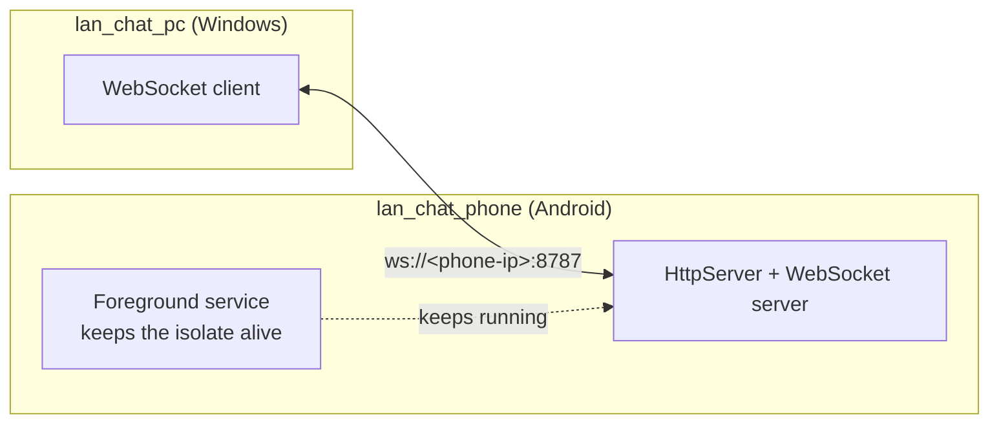
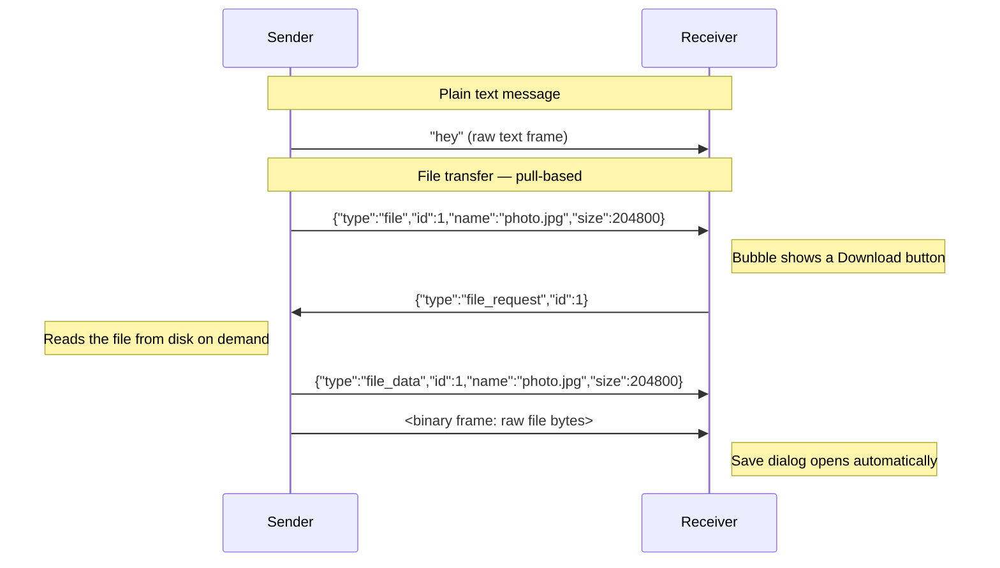
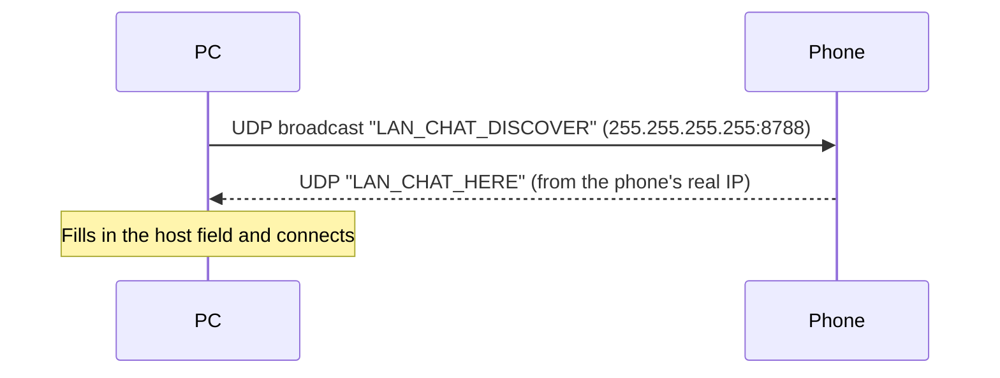

# LAN Chat

Two Flutter apps that chat and swap files over a plain WebSocket on a local
link — no internet, no accounts, no server infrastructure. Built for a
Windows PC talking to an Android phone over USB tethering, but any LAN/Wi-Fi
link between the two works the same way.

- **`lan_chat_pc`** — Windows desktop client. Connects out to the phone's IP.
- **`lan_chat_phone`** — Android app. Runs the WebSocket server and stays
  alive in the background via a foreground service.

## Architecture



The phone is always the server (`HttpServer.bind(anyIPv4, 8787)`); the PC is
always the client. It finds the phone's IP either automatically — a UDP
broadcast on port `8788` that the phone answers ("Find phone" button — see
below) — or manually, by typing the IP shown under Settings → About phone →
Status on most Android builds, or read from `ipconfig` on the PC side for
the USB-tethering adapter's gateway.

## Features

- **Auto-discovery on Wi-Fi/LAN** — the PC's "Find phone" button broadcasts a
  UDP ping on the local subnet; the phone answers with its address, so no
  one has to look up or type an IP when both devices share a Wi-Fi network.
  USB tethering still works too, either via auto-discovery or by typing the
  IP manually in Settings (⚙).
- **Text chat** over a single persistent WebSocket connection.
- **Pull-based file transfer** — sending a file only announces it (name +
  size); the receiver's tap triggers the actual byte transfer, so nothing
  moves over the wire until someone asks for it.
- **Auto-reconnect** (PC side) — a dropped connection retries with a capped
  backoff ladder (1s → 2s → 4s → 8s → 16s → 30s) instead of sitting
  disconnected. A manual disconnect cancels the retry loop.
- **Background survival** (phone side) — an Android foreground service keeps
  the WebSocket alive when the screen locks or the app is backgrounded.
- **Message timestamps**, animated message entrance, and connection-state
  transitions (status dot, status text, button enable/disable) are all
  animated rather than snapping.
- Dark, frosted-glass UI shared by both apps (`Glass`/`GlassBackground`
  widgets — blurred, tinted panels over a soft gradient background).

## Wire protocol

Everything travels over one WebSocket. Text frames are either plain chat
text or a JSON control frame; binary frames only ever follow a
`"file_data"` control frame.



| Frame | Direction | Purpose |
|---|---|---|
| plain text | either | chat message |
| `{"type":"file","id","name","size"}` | offering side → other side | announce a file, no bytes sent yet |
| `{"type":"file_request","id"}` | receiving side → offering side | ask for the bytes |
| `{"type":"file_data","id","name","size"}` + binary frame | offering side → receiving side | the actual file bytes |

### Discovery (separate from the chat socket)

A tiny UDP exchange on port `8788`, unrelated to the WebSocket on `8787`,
just to find the phone's IP:



If nothing answers within 3 seconds (no phone on the subnet, or a firewall
is blocking UDP broadcasts), the PC shows "No phone found on this network" —
type the IP into Settings (⚙) instead.

## Setup

### Prerequisites
- [Flutter SDK](https://docs.flutter.dev/get-started/install) (Dart SDK `^3.13.1`, per `pubspec.yaml`)
- Windows desktop support enabled (`flutter config --enable-windows-desktop`) for `lan_chat_pc`
- Android toolchain (Android Studio + SDK) for `lan_chat_phone`
- Both devices on the same network — either USB tethering (phone → PC) or the same Wi-Fi

### 1. Get dependencies
```sh
cd lan_chat_pc && flutter pub get
cd ../lan_chat_phone && flutter pub get
```

### 2. Run the phone app first
It's the server — start it, grant the notification and battery-optimization
prompts (needed for the foreground service to keep the socket alive), and
note the phone's IP address.
```sh
cd lan_chat_phone
flutter run   # or: flutter build apk --release
```

### 3. Run the PC app
```sh
cd lan_chat_pc
flutter run -d windows   # or: flutter build windows --release
```

### 4. Connect
On the same Wi-Fi/LAN, tap **Find phone** (the search icon) — it broadcasts
for the phone and connects automatically. Over USB tethering, or if
discovery doesn't find it, use Settings (⚙) to type the phone's IP directly
(`lan_chat_pc/lib/main.dart`'s `defaultHost` constant is just a starting
value for that field). Status turns green and shows the host once connected;
a dropped link auto-retries on its own.

## Building release binaries

```sh
# Windows .exe
cd lan_chat_pc && flutter build windows --release
# → lan_chat_pc/build/windows/x64/runner/Release/lan_chat_pc.exe

# Android .apk
cd lan_chat_phone && flutter build apk --release
# → lan_chat_phone/build/app/outputs/flutter-apk/app-release.apk
```

## Known limits

- **No access control on the server** — the phone accepts any WebSocket
  connection on port `8787`, and answers any discovery ping on `8788`. Fine
  over a private USB-tethered link; on shared Wi-Fi, anything else on that
  network could find and connect to it too.
- **Whole file held in memory** on both ends during a transfer — fine for
  photos/docs, a very large file will spike memory with no progress
  indicator.
- Two-device design: the phone server only tracks one active socket at a
  time, so a second client connecting will replace the first.
